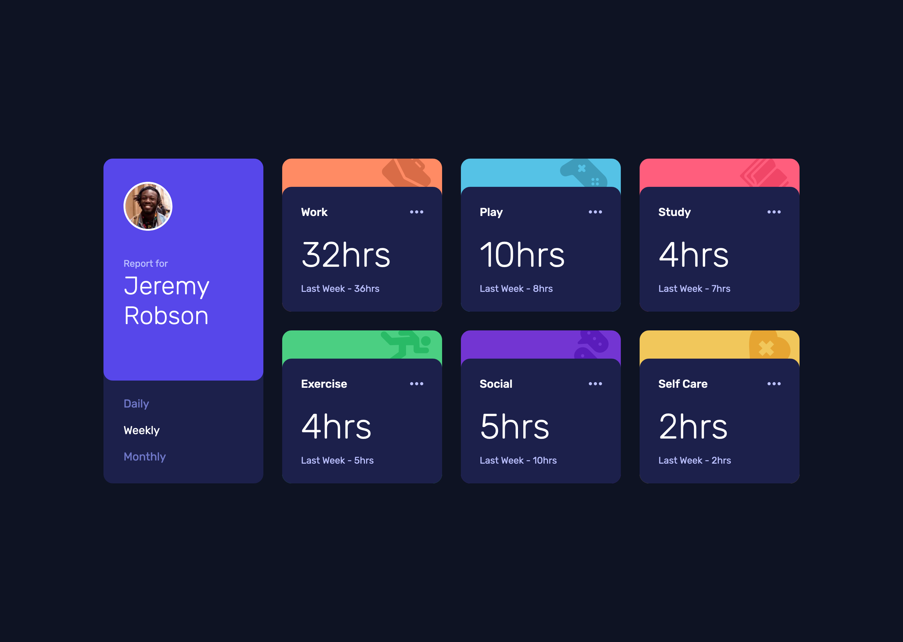
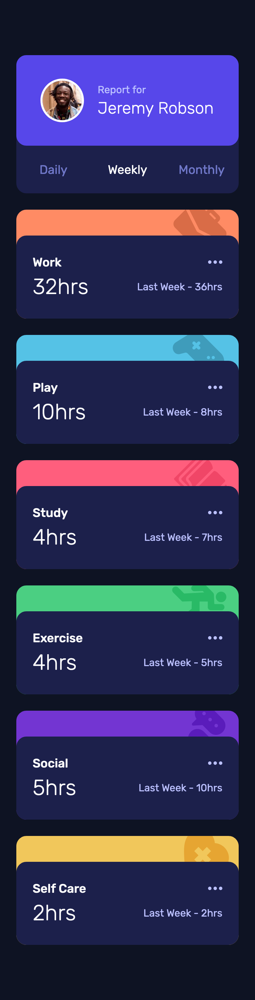

# Frontend Mentor - Time tracking dashboard solution

This is a solution to the [Time tracking dashboard challenge on Frontend Mentor](https://www.frontendmentor.io/challenges/time-tracking-dashboard-UIQ7167Jw). Frontend Mentor challenges help you improve your coding skills by building realistic projects.

## Table of contents

- [Overview](#overview)
  - [The challenge](#the-challenge)
  - [Screenshot](#screenshot)
  - [Links](#links)
- [Getting Started](#getting-started)
  - [Prerequisites](#prerequisites)
  - [Installation](#installation)
- [My process](#my-process)
  - [Built with](#built-with)
  - [What I learned](#what-i-learned)
  - [Continued development](#continued-development)
  - [Useful resources](#useful-resources)
- [Author](#author)

## Overview

### The challenge

Users should be able to:

- Switch between viewing Daily, Weekly, and Monthly stats
- View the optimal layout for the site depending on their device's screen size
- See hover states for all interactive elements on the page

### Screenshot

<div style='display: flex; gap: 20px;'>


</div>

### Links

- Solution URL: https://www.frontendmentor.io/solutions/time-tracking-dashboard-with-nextjs-tailwind-storybook-vitest-eq_u9Q3ztw
- Live Site URL: https://time-tracking-dashboard-gamma-puce.vercel.app

## Getting Started

To get a local copy up and running follow these simple steps:

### Prerequisites

Make sure you have the following software installed on your machine:

- [Node.js](https://nodejs.org/) (Node.js 18.17 or later)
- [pnpm](https://pnpm.io/)

### Installation

1. Clone the repository:

   ```sh
   git clone https://github.com/jaceleedev/time-tracking-dashboard.git
   ```

2. Navigate to the project directory:

   ```sh
   cd time-tracking-dashboard
   ```

3. Install dependencies using pnpm:

   ```sh
   pnpm install
   ```

4. Start the development server:

   ```sh
   pnpm dev
   ```

5. Open your browser and visit http://localhost:3000 to view the project.

6. To start Storybook, run the following command and access it at http://localhost:6006

   ```sh
   pnpm run storybook
   ```

7. To run tests, use the following command:

   ```sh
   pnpm run test
   ```

## My process

### Built with

- Next.js (v14.2.5)
- React.js (v18)
- TypeScript (v5)
- Tailwind CSS (v3.4.1)
- Storybook (v8.2.8)
- Vitest (v2.0.5)
- Semantic HTML5 markup
- CSS Grid, Flexbox
- SEO & web accessibility

### What I learned

1. Having learned a lot from my previous project, the newsletter form, this time I took the opportunity to consolidate what I had learned. As I was finishing the project, I discovered that fonts need to be applied separately in Storybook. I learned that if the fonts are different, it can cause confusion as the appearance in Storybook might differ from the actual project.

2. I tried using useSWR. Instead of importing the data.json provided by the challenge as a static file, I used the API functionality provided by Next.js to fetch it. This allowed me to retrieve data easily and conveniently without using useEffect. Also, I found its simple usage to be very efficient in progressing with the project. A similar library is tanstack-query, which seems to have more features than useSWR and could be useful for managing complex server states.

### Continued development

1. As the difficulty of the challenges increases in the future, I want to build up my skills by handling more complex logic and state management.

By focusing on these areas, I hope to continually improve my front-end development skills and create more efficient and sophisticated web applications.

### Useful resources

- [Next.js Documentation](https://nextjs.org/docs) - Comprehensive guide to Next.js features and API.
- [Tailwind CSS Documentation](https://tailwindcss.com/docs/installation) - Detailed documentation for Tailwind CSS.
- [Storybook Documentation](https://storybook.js.org/docs) - Official guide for building and testing UI components with Storybook.
- [Vitest Guide](https://vitest.dev/guide/) - Complete documentation for the Vitest testing framework.

## Author

- GitHub - [@jaceleedev](https://github.com/jaceleedev)
- Frontend Mentor - [@jaceleedev](https://www.frontendmentor.io/profile/jaceleedev)
